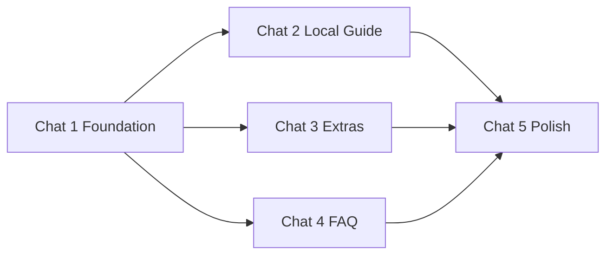

# TZ: Concierge hub — compact blocks + drill-down

**Версия:** 1.0  
**Статус:** Draft  
**Приоритет:** P1

## Summary

Главная guest app (`/`, `ConciergeContent`) разгружается: тяжёлые модули показываются как **функциональные compact-блоки** на home и открываются полностью на **drill-down routes**. Не пустые баннеры-мостики — на home остаётся полезное действие (sheet, accordion, maps, essentials).

## Проблема

Один длинный вертикальный скролл: полный `LocalGuide` (tabs, sticky bar, длинные списки), grid extras, FAQ accordion на одном уровне с Wi‑Fi. Нет иерархии «сейчас / справочно / каталог».

## Цель

- Home = рабочая поверхность с preview (progressive disclosure).
- Drill-down = полный модуль без урезания функционала.
- Единый паттерн: `ConciergeModuleSection` + `variant: 'compact' | 'full'` + route.

## IA (целевая главная)

```
[GuestAccessPanel]           — только !registered
[ArrivalGuideButton]         — как сейчас → /welcome
[WifiCompactRow]             — registered, без изменений
[LocalGuide compact]         — → /guide
[GuestExtras compact]        — → /services (+ sheet на home)
[GuestIssueReportCard]       — registered, без изменений
[NightAccessCard]            — night + registered, без изменений
[FAQ compact]                — → /faq
[ConciergeReceptionStrip]    — fixed bottom, без изменений
```

## Общие правила (все модули)

| Правило | Значение |
|---------|----------|
| Compact | ≤3 интерактивных элемента + header CTA «See all» |
| Full | текущее поведение модуля, без регрессий |
| API | `variant: 'compact' \| 'full'` на корневом UI-компоненте модуля |
| Drill-down | отдельный route (как `/welcome`), не sheet |
| Home CTA | в header секции (`title` + `See all →`), не единственная кликабельная зона |
| Return | `setInAppReturnTo(concierge.path)` при переходе на drill-down (как `ArrivalGuideButton`) |
| i18n | новые ключи в существующих namespace |
| Analytics | опционально P2: `hub_compact_*` / `hub_drilldown_*` — не блокер v1 |

## Новые routes

В `SITE_CONFIG.routes.app`:

| key | path | titleKey |
|-----|------|----------|
| `guide` | `/guide` | `localGuide` |
| `services` | `/services` | `guestServices` |
| `faq` | `/faq` | `faq` |

Страницы: `src/app/app-site/[locale]/{guide,services,faq}/page.tsx` — тонкие обёртки над full view.

## Out of scope (вся фича)

- Bottom nav
- Редизайн welcome, issue report, night access, reception strip
- Новые продуктовые модули
- Admin-настройки «что показывать на home»
- Session replay / hub analytics (отдельно от analytics-v1)

## Подзадачи (чаты)

| Chat | Файл TZ | Оценка | Зависимости |
|------|---------|--------|-------------|
| 1 | [concierge-hub-v1-chat1-foundation.md](./concierge-hub-v1-chat1-foundation.md) | S | — |
| 2 | [concierge-hub-v1-chat2-local-guide.md](./concierge-hub-v1-chat2-local-guide.md) | M | Chat 1 |
| 3 | [concierge-hub-v1-chat3-guest-extras.md](./concierge-hub-v1-chat3-guest-extras.md) | S–M | Chat 1 |
| 4 | [concierge-hub-v1-chat4-faq.md](./concierge-hub-v1-chat4-faq.md) | S | Chat 1 |
| 5 | [concierge-hub-v1-chat5-polish.md](./concierge-hub-v1-chat5-polish.md) | S | Chat 2–4 |

Chat 2–4 можно параллелить после Chat 1.



## Критерий готовности всей фичи

1. Главная заметно короче: нет sticky tabs local guide, нет full FAQ, нет full extras grid.
2. Каждый тяжёлый модуль даёт ценность на home и полноту на drill-down.
3. Паттерн единый: `ConciergeModuleSection` + `variant` + route.
4. Welcome / issue / wifi / reception — без регрессий.
5. После всех чатов: `npm run snapshot`.
