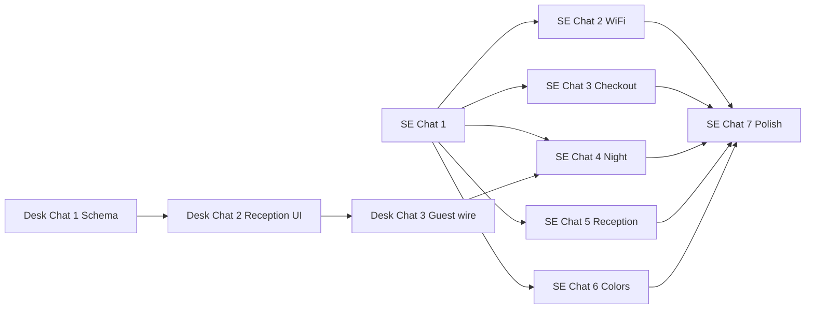

# TZ: Concierge stay essentials — bridge cards + sheets

**Версия:** 1.1  
**Статус:** Draft  
**Приоритет:** P1  
**Ветка:** `feat/concierge-stay-essentials`

## Summary

На concierge (`/`, registered) — список **мостиков-карточек** со справочной инфой о хостеле. На карточке только **title + иконка + read-indicator**; весь контент — в **BottomSheet (normal)** по tap. Без inline-данных на главной, без drill-down routes в v1.

## Проблема

Wi‑Fi одиночной строкой; night codes отдельной карточкой внизу скролла; checkout/reception размазаны по welcome и strip. Night access виден всем зарегистрированным гостям ночью — избыточно и небезопасно. Нет единого справочника «как устроен хостел»; пересечение с **My stay** недопустимо.

## Цель

- Справочник хостела = 4 мостика в фиксированном порядке → sheets.
- **My stay** chip = персональная бронь — не трогаем.
- **Reception strip** = связаться сейчас — не дублируем в sheets.
- **Night access** — только узкой аудитории (см. [guest-desk-check-in-v1.md](./guest-desk-check-in-v1.md) + Chat 4).

## Разделение jobs

| Поверхность | Job |
|-------------|-----|
| **My stay** (header chip) | Моя бронь, copy for reception, extend stay, room map link |
| **Stay essentials bridges** | Справочник хостела: Wi‑Fi, выезд, ночной доступ*, про ресепшен |
| **Reception strip** | Написать / позвонить сейчас |

\* Night access bridge — условная видимость, не для всех гостей.

## IA (concierge, registered)

```
[GuestAccessPanel]              — !registered only
[ArrivalGuideButton]
[StayEssentialsBridges]         — NEW (порядок ниже)
[services / issue / guide / faq — без изменений]
[ConciergeReceptionStrip]
```

Убрать с главной: `WifiCompactRow`, отдельную зону `NightAccessCard`.

## Порядок мостиков (сверху вниз)

1. **Wi‑Fi** → sheet
2. **Check-out** → sheet (policy выезда, не персональная бронь)
3. **Night access** → sheet (коды; мостик **скрыт**, если гость не в целевой аудитории)
4. **About reception** → sheet (часы, hint; без WA/call)

Мостик **отсутствует в списке** (не disabled), если нет контента или гость не проходит gate.

## Карточка-мостик (UI-контракт)

```
┌──────────────────────────────────────○┐  read dot: top-right, inset
│ Wi‑Fi                                 │  title only, top-left — БЕЗ subtitle
│                                       │
│ [icon 36×36]                      →   │  icon: bottom-left, угол карточки
└───────────────────────────────────────┘
     фон — accentColor из admin (Chat 6)
```

| Элемент | Правило |
|---------|---------|
| Title | Одна строка, i18n |
| Subtitle | **Запрещён** |
| Иконка | 36×36 px, Lucide, `absolute bottom-left` |
| Chevron | справа |
| Read indicator | top-right inset; unread = ring; read = filled |
| Min-height | ~88–96px |
| Tap | вся карточка → sheet |

### Read state (≠ visibility)

- Только onboarding «просмотрел sheet».
- `localStorage`: `stayEssentialsRead:{tenantSlug}:{stayId}:{bridgeId}`
- **Не** использовать read state для скрытия night access.

### Night access visibility (кратко)

Мостик показывается только если `resolveShowNightAccessBridge(...) === true`:

1. `hasNightDoorCodes(settings)`
2. `isWithinArrivalWindow(checkInAt)` — день заезда + следующий день
3. `isNightMode` **или** (день заезда и сейчас после `reception.close`)
4. `!key_issued_at` на stay (reception) — см. [guest-desk-check-in-v1](./guest-desk-check-in-v1.md)
5. `!nightAccessDismissed(stayId)` — guest self-dismiss в sheet (fallback)
6. `registered`

Детали: [Chat 4](./concierge-stay-essentials-v1-chat4-night-access-sheet.md).

## Sheets (общие правила)

- `BottomSheet` normal size.
- Контент только в sheet.
- Reception strip скрывается при открытом sheet.
- Без route `/stay` в v1.

## Связанные TZ

| TZ | Связь |
|----|--------|
| [guest-desk-check-in-v1.md](./guest-desk-check-in-v1.md) | `key_issued_at` на reception → скрытие night bridge |
| [concierge-hub-v1.md](./concierge-hub-v1.md) | hub-модули ниже stay essentials |

## Out of scope v1

- Subtitle на мостиках, inline secrets на home
- Drill-down `/stay`, bed row в essentials
- Primary WA/extend в sheets
- Паспорт scan, POS, полный PMS
- Wi‑Fi QR, locker, kitchen hours

## Подзадачи (чаты)

| Chat | Файл | Оценка | Зависимости |
|------|------|--------|-------------|
| 1 | [chat1-foundation.md](./concierge-stay-essentials-v1-chat1-foundation.md) | S | — |
| 2 | [chat2-wifi-sheet.md](./concierge-stay-essentials-v1-chat2-wifi-sheet.md) | S | Chat 1 |
| 3 | [chat3-checkout-sheet.md](./concierge-stay-essentials-v1-chat3-checkout-sheet.md) | S | Chat 1 |
| 4 | [chat4-night-access-sheet.md](./concierge-stay-essentials-v1-chat4-night-access-sheet.md) | S–M | Chat 1; guest-desk Chat 1–2 опционально |
| 5 | [chat5-reception-sheet.md](./concierge-stay-essentials-v1-chat5-reception-sheet.md) | S | Chat 1 |
| 6 | [chat6-admin-colors.md](./concierge-stay-essentials-v1-chat6-admin-colors.md) | S | Chat 1 |
| 7 | [chat7-polish.md](./concierge-stay-essentials-v1-chat7-polish.md) | S | Chat 2–6 |

**Reception desk check-in** (отдельная ветка/чаты): [guest-desk-check-in-v1](./guest-desk-check-in-v1.md).



## Критерий готовности

1. Четыре мостика в порядке; title only; layout icon/dot по контракту.
2. Sheets — вся информация; home без секретов.
3. `WifiCompactRow` и `NightAccessCard` убраны.
4. Night bridge скрыт для большинства (gate + key issued).
5. My stay + reception strip без регрессий.
6. Read dot персистится per stay.
