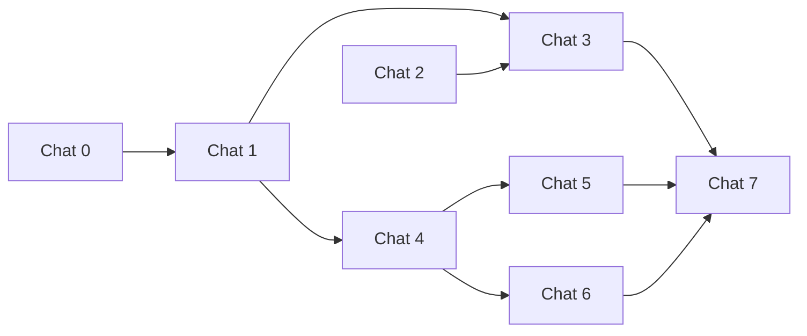

# TZ: Guest hybrid notifications (PWA + WhatsApp + SMS)

**Версия:** 1.0  
**Статус:** Draft  
**Приоритет:** P1  
**Ветка:** `feat/guest-notifications-v1`

## Summary

Production-ready гибридная доставка **операционных** уведомлений гостю в **guest app** (`app-site`): Web Push (PWA), опционально WhatsApp через gateway (только после явного opt-in), fallback SMS (Twilio). GDPR: согласия отдельно от `tourism_contact_whatsapp`. Router — **server-only**, без публичного send API.

## Проблема

- Нет native app; гость не всегда открывает guest app.
- Нужен быстрый канал в EU с минимизацией ban-риска WA и правом отзыва (STOP).
- Сейчас reception **копирует** шаблон доступа (`resolveGuestAccessMessageTemplate`) — автоматической доставки нет.
- `tourism_contact_whatsapp` — юридический контакт туррегистрации, **не** согласие на transactional WA.

## Цель

- PWA на `app-site` + сохранение `PushSubscription` на `stay_id` после guest session.
- UI opt-in: checkbox WA **unchecked by default**, disclaimer anti-spam, пояснение SMS / PWA fallback.
- Серверный router: Push attempt → WA (если opt-in) → SMS.
- Inbound webhook: ответ `STOP` → отзыв WA consent + подтверждение по SMS/Push.
- Reception (EN): кнопка отправки access message через router (v1 не обязана заменять clipboard).

## Зафиксированные решения

| Тема | Решение |
|------|---------|
| Сайт | PWA только **app-site** (`{slug}.app.*`), не landing / reception / admin |
| i18n guest | **en / ru** (`next-intl`); reception UI — **EN only**, без next-intl |
| Auth guest | `resolveGuestSessionFromCookies(tenantSlug)`; DB — `service_role` |
| Auth reception | `assertReceptionAuthenticated` |
| Телефон | `sms_contact_e164` на stay; prefill из tourism WA — только подсказка UI, не consent |
| WA consent | `whatsapp_messaging_allowed` default **false** + `whatsapp_messaging_consent_at` |
| SMS | `sms_transactional_allowed` — default и правовая база фиксируются в **Chat 0** |
| Push «online» | Не проверяем online: если есть `web_push_subscription` — **попытка** push |
| API | Нет открытого `POST /api/notifications/send`; router в `features/guest-notifications` |
| FSD | `features/guest-notifications` + `entities/guest-notification-preferences` |
| Tenant flag | `settings.guestStay.guestNotificationsEnabled` (default false) — **Chat 7** |
| Секреты | `VAPID_*`, `TWILIO_*`, `WHATSAPP_GATEWAY_*` в `process.env` |

## Модель данных (обзор)

**`guest_stays`** (миграция `029_guest_notifications.sql`):

| Поле | Тип |
|------|-----|
| `sms_contact_e164` | text nullable |
| `whatsapp_messaging_allowed` | boolean NOT NULL default false |
| `whatsapp_messaging_consent_at` | timestamptz nullable |
| `whatsapp_messaging_revoked_at` | timestamptz nullable |
| `sms_transactional_allowed` | boolean NOT NULL default true* |
| `web_push_subscription` | jsonb nullable |
| `web_push_updated_at` | timestamptz nullable |

\* Default уточняется в Chat 0.

**Tenant:** `settings.guestStay.guestNotificationsEnabled`.

## Не делаем в v1

- Промо-рассылки, сегментация, marketing campaigns
- Полноценный support-чат в WA
- Несколько push endpoints на stay (v2: отдельная таблица)
- Per-tenant credentials gateway в admin (v2)
- Background Sync очередь офлайн-сообщений
- OCR / eTurist

## Подзадачи (чаты)

| Chat | Файл | Оценка | Зависимости |
|------|------|--------|-------------|
| 0 | [chat0-product-gdpr.md](./guest-notifications-v1-chat0-product-gdpr.md) | S | — |
| 1 | [chat1-schema-entity.md](./guest-notifications-v1-chat1-schema-entity.md) | M | 0 |
| 2 | [chat2-pwa-app-site.md](./guest-notifications-v1-chat2-pwa-app-site.md) | M | — |
| 3 | [chat3-guest-ui-push.md](./guest-notifications-v1-chat3-guest-ui-push.md) | M–L | 1, 2 |
| 4 | [chat4-notification-router.md](./guest-notifications-v1-chat4-notification-router.md) | L | 1 |
| 5 | [chat5-reception-send.md](./guest-notifications-v1-chat5-reception-send.md) | M | 4 |
| 6 | [chat6-whatsapp-webhook-stop.md](./guest-notifications-v1-chat6-whatsapp-webhook-stop.md) | M | 1, 4 |
| 7 | [chat7-admin-smoke-polish.md](./guest-notifications-v1-chat7-admin-smoke-polish.md) | S–M | 3, 5, 6 |



## Критерий готовности продукта

1. Tenant с `guestNotificationsEnabled`: гость после session может opt-in WA и зарегистрировать push; без opt-in WA router не шлёт в gateway.
2. Reception может отправить access message; виден итог канала (push / wa / sms / failed).
3. `STOP` в inbound webhook отзывает WA consent и шлёт подтверждение без WA.
4. `tourism_contact_whatsapp` не используется как флаг согласия на уведомления.
5. Секреты не попадают в client bundle (кроме `VAPID_PUBLIC_KEY`).

## Универсальный промпт для чатов

```text
Ты работаешь в monorepo frontdesk_mate: Next.js 16 App Router, TypeScript strict, Supabase (миграции supabase/migrations, admin client), FSD (UI/model/api раздельно, импорты между слайсами только через index.ts).

Сайты: app-site = guest PWA ({slug}.app.*, next-intl en/ru); reception-site = EN only, auth assertReceptionAuthenticated; admin = /admin.

Guest session: resolveGuestSessionFromCookies(tenantSlug). Не путать tourism_contact_whatsapp с whatsapp_messaging_allowed.

Задача: см. docs/tz/guest-notifications-v1-chatN-*.md (strict file scope). Минимальный diff; router server-only; секреты process.env. Перед кодом — краткое ТЗ; один файл за итерацию.
```
