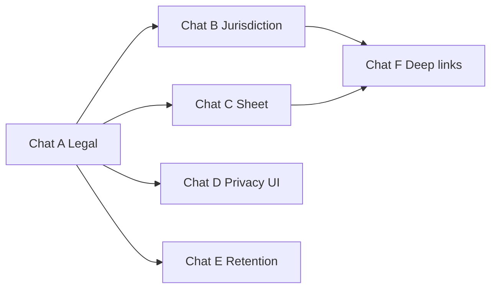

# TZ: Guest tourism registration — Compliance & multi-jurisdiction (v2)

**Версия:** 1.0  
**Статус:** Draft  
**Приоритет:** P1  
**Базовая реализация:** [guest-tourism-registration-mne-v1.md](./guest-tourism-registration-mne-v1.md) (чаты 0–6)

## Summary

Надстройка над уже реализованным модулем туристической регистрации: **юридически осмысленный** сбор данных (GDPR / ME ZZPL), **UX** при блокировке Settlement (bottom sheet), **убрать хардкод Montenegro** из продукта и сделать профили юрисдикций, **retention** документов в storage.

## Проблема

- v1 закрывает операционный MNE-flow, но в UI и API зашиты тексты и поля «Черногория + штамп въезда».
- При клике на заблокированный chip **Settlement** (PIN есть, tourism не complete) гость **перекидывается на Register** без объясняющего sheet (в отличие от PIN gate → `CheckInRequiredSheet`).
- Нет guest-facing privacy notice, зафиксированной retention policy и job удаления — gap относительно GDPR storage limitation.
- Юридические формулировки (контролёр, основание, сроки) не зафиксированы в продукте.

## Цель

1. Зафиксировать legal/product решения **до кода** (Chat A).
2. Профиль юрисдикции в tenant settings вместо boolean + «Montenegro» везде (Chat B).
3. Sheet «почему Settlement недоступен» + CTA на Register (Chat C).
4. Privacy block на шаге Register (Chat D).
5. Автоудаление документов по policy (Chat E).
6. Согласованные deep links с concierge / welcome (Chat F).

## Зафиксированные решения (v2)

| Тема | Решение |
|------|---------|
| v1 boolean `tourismRegistrationRequired` | Миграция на структуру с **backward compat** (Chat B) |
| ME default profile | `passport` + `entry_stamp`, тексты с `{country}` |
| Tourism WhatsApp | Как в v1; **не** смешивать с marketing/notifications opt-in (см. [guest-notifications-v1-chat0-product-gdpr.md](./guest-notifications-v1-chat0-product-gdpr.md)) |
| Settlement locked UX | Отдельный sheet, не замена шага Register |
| Retention | Сроки из Chat A; реализация job в Chat E |

## Не делаем в v2

- Интеграция eTurist / гос. API, OCR
- Редактирование tourism guests после `tourism_registration_completed_at`
- Полный self-service GDPR portal (export/erase) — только policy + retention; erase по запросу вне v2 или отдельный эпик

## Подзадачи (чаты)

| Chat | Файл | Оценка | Зависимости |
|------|------|--------|-------------|
| A | [chatA-legal-gdpr.md](./guest-tourism-registration-compliance-v2-chatA-legal-gdpr.md) | S–M | — |
| B | [chatB-jurisdiction.md](./guest-tourism-registration-compliance-v2-chatB-jurisdiction.md) | M | A |
| C | [chatC-settlement-sheet.md](./guest-tourism-registration-compliance-v2-chatC-settlement-sheet.md) | S | A (короткий copy) |
| D | [chatD-privacy-ui.md](./guest-tourism-registration-compliance-v2-chatD-privacy-ui.md) | S | A |
| E | [chatE-retention.md](./guest-tourism-registration-compliance-v2-chatE-retention.md) | M–L | A |
| F | [chatF-deep-links.md](./guest-tourism-registration-compliance-v2-chatF-deep-links.md) | S | B, C |



## Критерий готовности

1. Tenant вне ME: включённая регистрация **не** показывает «Montenegro» и может иметь другой набор документов (по профилю).
2. Гость с PIN, tourism incomplete: клик locked **Settlement** → sheet с причиной → CTA на Register.
3. На Register виден privacy notice (тексты из A).
4. Документы в `guest-documents` удаляются по утверждённой policy (E).
5. `SMOKE.md` обновлён (F).

## Промпт для мастер-чата

```
Эпик Guest tourism registration compliance v2. Мастер-TZ: docs/tz/guest-tourism-registration-compliance-v2.md.
Начинать с Chat A (legal/GDPR без кода), затем B/C/D/E/F по зависимостям. Strict file scope — только файлы из соответствующего chat-*.md.
```
