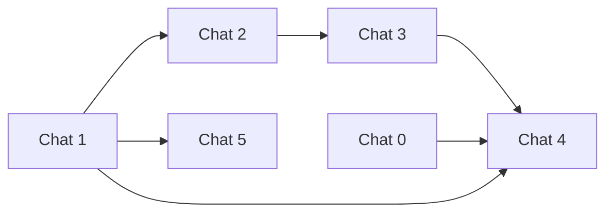

# TZ: Guest tourism registration (Montenegro)

**Версия:** 1.0  
**Статус:** Draft  
**Приоритет:** P1  
**Ветка:** `feat/guest-tourism-registration-mne`

## Summary

Обязательный сбор данных для туристической регистрации в **guest app**: ФИО каждого проживающего, **один WhatsApp на stay**, фото первой страницы паспорта и штампа въезда. Документы в **private** Supabase Storage; имя на брони (`guest_stays.guest_name` с reception) **не перезаписывается**. На **reception** — просмотр и галочка «сдано в турорганизацию».

## Проблема

- Юридические требования ME: данные и фото по **каждому** человеку.
- На бронь часто приезжает другой человек или несколько гостей на одну выдачу access.
- Шаг settlement перегружен (Wi‑Fi, кровать, правила) — регистрацию нельзя терять внизу экрана.

## Цель

- Новый шаг arrival journey **`register`** между `arrival` и `settlement`.
- **Settlement** (кровать, Wi‑Fi и т.д.) недоступен, пока регистрация не завершена (при включённом флаге tenant).
- Multi-guest: 1..N записей на `stay_id`, у каждого свои фото.
- Client-side сжатие изображений перед upload.
- Reception: статус, превью (signed URL), checkbox **`tourism_exported_at`**.

## Зафиксированные решения

| Тема | Решение |
|------|---------|
| WhatsApp | Один номер на весь stay (контактное лицо), задаётся при завершении регистрации |
| Имя с брони | `guest_name` только read-only в UI |
| Reception | Галочка «Submitted to tourism organization» → `tourism_exported_at` |
| После complete | В v1 нельзя добавлять новых гостей (reject) |

## Модель данных (обзор)

**`guest_stays`:**

| Поле | Тип |
|------|-----|
| `tourism_contact_whatsapp` | text nullable |
| `tourism_registration_completed_at` | timestamptz nullable |
| `tourism_exported_at` | timestamptz nullable |

**`guest_stay_tourism_guests`:** `stay_id`, `first_name`, `last_name`, `passport_storage_path`, `entry_stamp_storage_path`, `created_at`.

**Storage:** bucket `guest-documents`, private, writes только service_role.

**Tenant flag:** `settings.guestStay.tourismRegistrationRequired` (boolean, default false).

## Не делаем в v1

- OCR, интеграция eTurist / гос. API
- Редактирование после `tourism_registration_completed_at`
- Автоудаление документов (retention) — отдельная задача
- Ожидаемое число гостей с reception (`expected_guest_count`) — v2

## Подзадачи (чаты)

| Chat | Файл | Оценка | Зависимости |
|------|------|--------|-------------|
| 0 | [chat0-admin-flag.md](./guest-tourism-registration-mne-v1-chat0-admin-flag.md) | S | — |
| 1 | [chat1-schema-storage.md](./guest-tourism-registration-mne-v1-chat1-schema-storage.md) | M | — |
| 2 | [chat2-guest-api.md](./guest-tourism-registration-mne-v1-chat2-guest-api.md) | M | 1 |
| 3 | [chat3-guest-ui.md](./guest-tourism-registration-mne-v1-chat3-guest-ui.md) | M–L | 2 |
| 4 | [chat4-arrival-gate.md](./guest-tourism-registration-mne-v1-chat4-arrival-gate.md) | M | 0, 1, 3 |
| 5 | [chat5-reception.md](./guest-tourism-registration-mne-v1-chat5-reception.md) | M | 1 |
| 6 | [chat6-polish.md](./guest-tourism-registration-mne-v1-chat6-polish.md) | S | все |

## Критерий готовности продукта

1. Tenant с флагом on: гость после PIN не видит кровать, пока не зарегистрировал всех и не завершил шаг.
2. Несколько гостей на один stay — отдельные ФИО и фото.
3. Документы не доступны публично; reception открывает по signed URL.
4. Галочка export на reception сохраняется независимо от guest complete.
