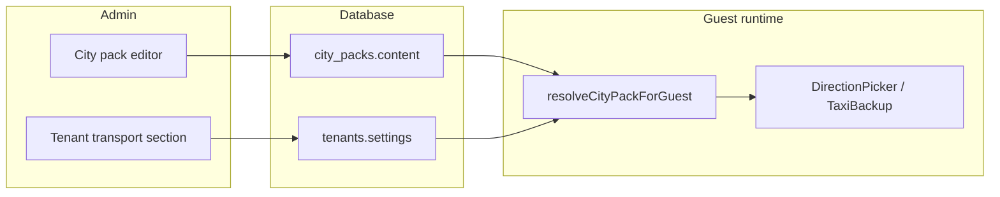

# TZ: Transport editor — city pack + hostel last mile (v1)

**Version:** 1.0  
**Status:** Implemented (Phases 1–3 + preview, readiness, route parity)  
**Depends on:** City pack wizard (`city_packs.content`), arrival guide (`DirectionPicker`), tenant settings  
**Goal:** Scale cities without code/i18n edits; tenants inherit city transport and only override hostel-specific fields.

## Problem

Today:

- Route copy and metadata live in **code packs** (`sarajevo.ts`, `kotor.ts`) + **i18n JSON**.
- `city_packs.content` only stores `places`, `enabledRoutes`, `recommendedTaxi` — routes are not editable in admin.
- DB `recommendedTaxi` is saved but **not merged** into guest runtime (`useTenantCityPack`).
- Every tenant in the same city would duplicate hub→district data if we moved routes to tenant settings.

## Principle

| Layer | Source | Who edits | Scope |
|-------|--------|-----------|-------|
| **City transport** | `city_packs.content` | Platform admin, once per city | Hubs, public transit, taxi estimates, city taxi service |
| **Hostel last mile** | `tenants.settings` | Hostel admin | Address, walk override, door access, taxi phone override, reception backup |

**Rule:** Tenant never fills city-level route data. Empty tenant field → city pack default.

## Architecture



### Merge order (guest)

1. Load code pack skeleton (`getCityPack(id)`) — categories, route ids, dev fallback only.
2. Overlay **`city_packs.content`** when `status === 'ready'` (routes, taxi, warnings, places).
3. Filter by `content.enabledRoutes`.
4. Apply **tenant overrides** only where defined (walk, address substitution, taxi phone).

Code pack + i18n become **seed / fallback for migration**, not the operational source of truth.

---

## Data model

### Locales in JSONB

Route copy is stored inline per locale (no deploy to change Sarajevo airport text):

```ts
type LocalizedText = { en: string; ru?: string };

/** Placeholder: `{address}` replaced at runtime with tenant address. */
type LocalizedTemplate = LocalizedText;
```

Guest UI resolves: `copy.en` or `copy.ru` by active locale; fallback `ru → en` if missing.

### `CityPackContent` (extended)

```ts
interface CityPackRouteCopy {
  publicTitle: LocalizedText;
  publicSummary: LocalizedText;
  publicPreview: LocalizedText;      // walk to stop / start of leg
  publicText: LocalizedText;         // step-by-step transit or walk-only body
  publicGetOffAt: LocalizedText;
  publicWalkToHostel: LocalizedTemplate; // city default last mile; tenant may override
  taxiCost: LocalizedText;
  taxiPickupPoint: LocalizedText;
}

interface CityPackRouteTransit {
  durationMin: number;
  stops?: number;
  ticketPrice?: { kioskKM: number; driverKM: number };
  fareLabel?: LocalizedText;         // custom fare chip (shuttle, free, etc.)
  officialRouteUrl?: string;
}

interface CityPackRouteTaxi {
  priceKM: { min: number; max: number };
  priceEUR: { min: number; max: number };
  durationMin: { min: number; max: number };
}

interface CityPackRouteContent {
  category: 'airport' | 'bus' | 'train';
  routeMode?: 'transit' | 'walk_only';
  isActive?: boolean;
  hint?: LocalizedText;              // e.g. bus hub clarification
  locationLabel: LocalizedText;      // hub name in genitive / subtitle
  copy: CityPackRouteCopy;
  transit: CityPackRouteTransit;
  taxi: CityPackRouteTaxi;
}

interface CityPackContent {
  places?: CityPackAdminPlace[];
  enabledRoutes?: RouteId[];
  routes?: Partial<Record<RouteId, CityPackRouteContent>>;
  recommendedTaxi?: RecommendedTaxi;
  warnings?: {
    taxiStand?: LocalizedText;
    taxiMeter?: LocalizedText;
    busClarification?: LocalizedText;
  };
  preTripTips?: ('sundayClosure')[];
}
```

`RouteId`: `airport` | `bus_central` | `bus_istochno` | `train_station`.

### Tenant settings (hostel only)

Already in `TenantSettings`; no city route duplication:

```ts
interface TenantTransportSettings {
  contacts?: {
    address?: string;
    mapsUrl?: string;
    taxiPhoneRaw?: string;
    taxiPhoneMask?: string;
    feedbackPhoneRaw?: string;
  };
  reception?: {
    canHelpWithTaxi?: boolean;
    whatsappEnabled?: boolean;
    whatsappPhoneRaw?: string;
    availabilityHint?: string;
  };
  /** Global last-mile override (all routes). */
  arrivalWalkToHostel?: LocalizedText;
  /** Per-route last-mile override — only for enabled city routes. */
  arrivalWalkToHostelByRoute?: Partial<Record<RouteId, LocalizedText>>;
  arrivalAccess?: ArrivalAccessConfig; // doors/codes after address — separate section
}
```

**Not in tenant:** hub list, transit steps, taxi price ranges, official schedule URLs, recommended taxi name (city).

### Resolved runtime types

```ts
interface ResolvedRouteConfig {
  id: RouteId;
  category: RouteCategory;
  routeMode: RouteMode;
  // All guest-facing strings already resolved for locale
  title: string;
  summary: string;
  // ...
  metadata: { taxi: CityPackRouteTaxi; transit: CityPackRouteTransit };
}

function resolveWalkToHostel(
  routeId: RouteId,
  city: CityPackContent,
  tenant: TenantSettings,
  locale: Locale,
  address: string
): string;
```

**Precedence for walk-to-hostel:**

1. `tenant.arrivalWalkToHostelByRoute[routeId]` (locale)
2. `tenant.arrivalWalkToHostel` (locale)
3. `city.routes[routeId].copy.publicWalkToHostel` with `{address}` substitution
4. Empty string + readiness warning in admin (should not ship to guests)

**Precedence for recommended taxi phone:**

1. `tenant.contacts.taxiPhoneRaw`
2. `city.recommendedTaxi.phoneRaw`
3. No taxi CTA block (reception backup may still show)

---

## Runtime: `resolveCityPackForGuest`

New module: `src/entities/city-pack/lib/resolveCityPackForGuest.ts`

```ts
export function resolveCityPackForGuest(input: {
  packId: CityPackId;
  content: CityPackContent | undefined;
  packStatus: CityPackStatus;
  locale: Locale;
}): ResolvedCityPack;
```

Steps:

1. `base = getCityPack(packId)` — categories, empty routes for dynamic packs.
2. If `packStatus !== 'ready'` → guest gets no routes (current behaviour).
3. `mergeRoutes(base.routes, content.routes)` — DB wins field-by-field; missing fields fall back to code seed during migration.
4. `mergeRecommendedTaxi(base.recommendedTaxi, content.recommendedTaxi)`.
5. `mergeWarnings(base.contentKeys, content.warnings)` → resolved strings for locale.
6. `applyEnabledRoutesToCityPack(merged, content.enabledRoutes ?? [])`.
7. Map to `ResolvedRouteConfig[]` with locale resolution.

Replace direct `useTenantCityPack` → `getCityPack` path in `TenantProvider` with this resolver (pass `content` from server via `getTenantConfig` / `getCityPackForAdmin` snapshot).

**Server payload addition on `TenantConfig`:**

```ts
cityPackContent?: CityPackContent; // ready pack only
cityPackStatus?: CityPackStatus;
```

---

## Admin UI

### A. City pack — Routes step (extend wizard)

**Location:** `/admin/city-packs/[id]` → step **Routes & guide** (v2).

**Pack-level fields:**

| Field | Notes |
|-------|-------|
| Enabled routes | Checkboxes (existing) |
| Recommended taxi | name, phoneRaw, phoneMask |
| Taxi stand warning | en / ru |
| Taxi meter warning | en / ru |
| Bus clarification | en / ru (Sarajevo-style sub-routes) |
| Pre-trip tips | e.g. sunday closure toggle |

**Per enabled `RouteId` — accordion:**

| Group | Fields |
|-------|--------|
| Mode | `routeMode`, `isActive` |
| Labels | `locationLabel`, optional `hint` |
| Public route copy | title, summary, preview, text, getOffAt, **default walkToHostel** (`{address}` hint) |
| Transit | durationMin, stops, kiosk/driver KM, fareLabel OR ticket prices, officialRouteUrl |
| Taxi backup | price KM/EUR ranges, duration range, taxiCost text, pickupPoint text |

Preview panel: mini DirectionPicker for selected route (locale toggle en/ru).

**Gate:** unchanged — `enabledRoutes.length >= 1`; optional: require `copy.publicTitle.en` per enabled route before publish.

### B. Tenant — Last mile section

**Location:** `/admin/tenants/[slug]` → new subsection **Arrival transport** (or extend Contacts).

| Field | Notes |
|-------|-------|
| Address, Maps URL | existing Contacts |
| Global walk override | en / ru textarea |
| Per-route walk | One field per **tenant's enabled route** (from city pack), en / ru |
| Taxi phone override | existing |
| Reception taxi backup | existing checkboxes |
| Link | → Arrival access (doors) — not duplicated here |

Show read-only preview of city default walk for each route (“City default: …”) so hostel admin knows what they override.

**Readiness:** flag incomplete if address missing or no walk text (tenant or city default) for any enabled route.

---

## Migration

### Phase 1 — Schema + merge (no admin UI yet)

1. Extend `CityPackContent` TypeScript types.
2. Implement `resolveCityPackForGuest` + wire `TenantProvider`.
3. Migration `023_city_pack_routes.sql`: seed `content.routes` for `sarajevo` and `kotor` from current i18n (`en.json` / `ru.json`) + code metadata.
4. Fix `recommendedTaxi` merge bug (DB → guest).

### Phase 2 — City pack route editor

1. Wizard routes step v2 (per-route accordions, locale tabs).
2. Save to `city_packs.content.routes`.
3. Remove dependency on editing `sarajevo.ts` for copy changes.

### Phase 3 — Tenant last mile UI

1. `arrivalWalkToHostelByRoute` admin fields + save in `admin/actions.ts`.
2. Localized `arrivalWalkToHostel` (migrate existing string → `{ en: "..." }` on read).
3. Readiness + section hints.

### Phase 4 — Deprecate code routes (optional)

1. New cities: DB-only routes, empty code skeleton.
2. Stop adding keys to `shared/i18n/*` under `cityPacks.*.routes`.
3. Keep `getCityPack` for categories/icons only or move categories to DB.

---

## Out of scope (v1)

- `guestExtras.partner_transfer` — Concierge commerce, not arrival guide transport.
- Live GTFS / real-time transit APIs.
- Per-tenant enabled routes (tenant uses city's `enabledRoutes` only).
- Geo polyline / map drawing in admin.

---

## Key files (implementation)

| Area | Path |
|------|------|
| Types | `src/entities/city-pack/model/types.ts` |
| Merge | `src/entities/city-pack/lib/resolveCityPackForGuest.ts` |
| Guest hook | `src/entities/tenant/model/tenant-config.ts`, `TenantProvider.tsx` |
| Walk override | `src/features/direction-picker/lib/resolveWalkToHostel.ts` |
| City admin | `src/app/admin/(protected)/city-packs/ui/CityPackWizard.tsx` |
| Tenant admin | `src/app/admin/(protected)/tenants/sections/` (new `ArrivalTransportFields.tsx`) |
| Seed | `supabase/migrations/023_city_pack_routes.sql` |

---

## QA

### City pack

- [ ] Edit airport taxi EUR range in city pack admin → all Sarajevo tenants see new range without tenant save.
- [ ] Disable `bus_istochno` in pack → sub-route hint hidden for all tenants.
- [ ] Publish draft pack → tenants on that pack get routes; draft → no routes in guest app.
- [ ] en/ru locale switch shows correct copy from DB.

### Tenant

- [ ] Empty walk override → city default walk with tenant `{address}`.
- [ ] Per-route override beats global `arrivalWalkToHostel`.
- [ ] `taxiPhoneRaw` on tenant beats city recommended taxi number.
- [ ] Two hostels same city pack, different addresses → same transit steps, different final walk line.

### Regression

- [ ] DirectionPicker, TaxiBackupSheet, PreTripInfo, route feedback WA unchanged in behaviour.
- [ ] `partner_transfer` extra unaffected.
